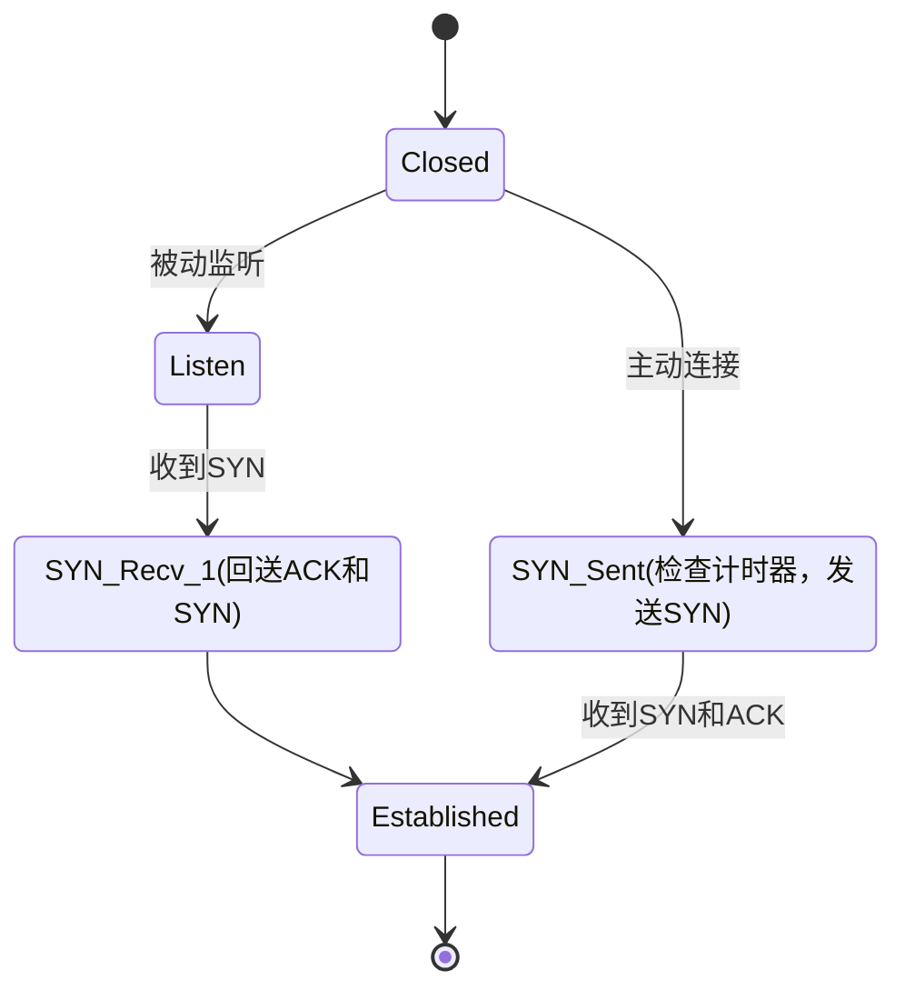
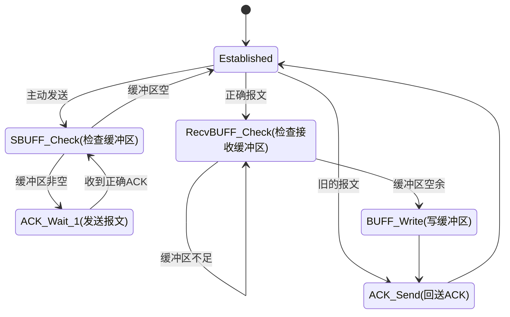
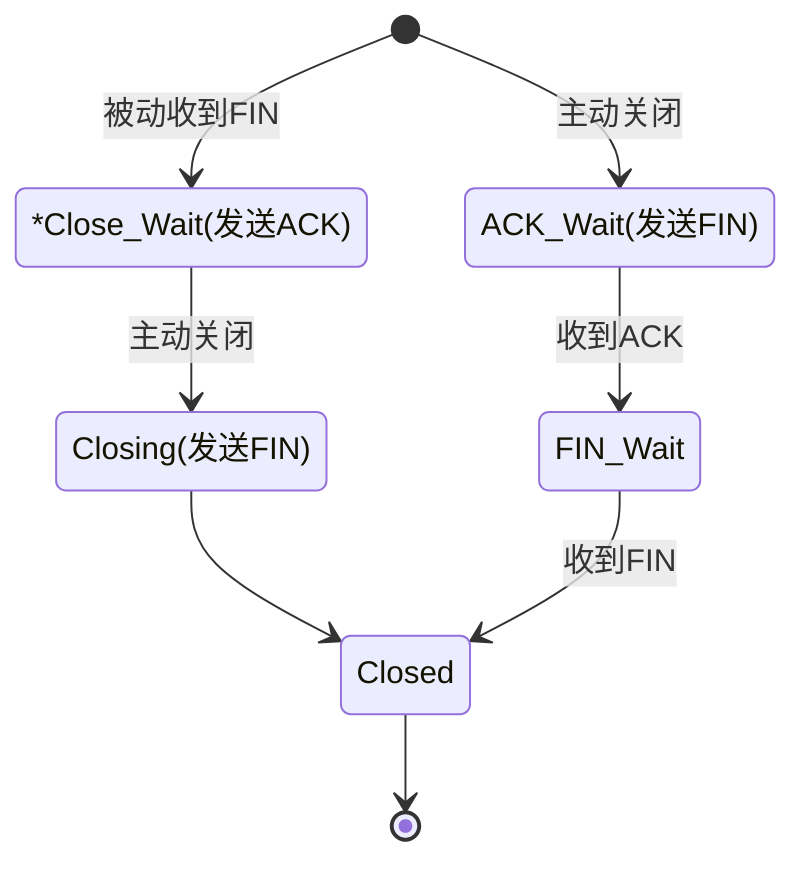

<p>
	<center><font size=8>UCONN</font></center><br>
	<center><font size=5 face="楷体">基于UDP的可靠传输</font></center>
	<center><font face="楷体">Author：BobLi Swigger</font></center>
	<center><font face="楷体">日期：2020年12月04日</font></center>
</p>


<h1>目录</h1>

[TOC]

# 概述

本仓库要实现的目标是基于Socket套接字（UDP）编程实现的可靠传输协议。

最终要实现的效果是：提供一个编程接口，该接口提供缓冲区传输和文件传输功能，即将发送端的缓冲区无差错的复制到接收端的缓冲区上，或将文件无差错的复制到发送端。类似于用UDP实现一个TCP协议。

本仓库目前实现进度：

- [x] Uconn: 可靠传输
- [ ] 收发缓冲区接口
- [x] uSendFile收发文件接口

# uconn协议

## 建立连接

### 连接的建立

设置计数器，每次**状态**的转换都将计数器清零。每次转换到新的状态，都率先检查计时器，若超过最大尝试次数则关闭连接。



每个有条件的状态转换都是"阻塞"的。注意，这里的阻塞并不是说明其函数是阻塞的，而是仅当满足条件才进行状态转换。当某一状态阻塞时，每隔一段时间刷新该状态（重新执行动作），并将计数器+1。

注意，每隔一段时间刷新状态并将计数器+1导致的结果就是：一些特殊状态（比如监听），有可能在一定时间后返回连接失败，因此如果想持续监听，需要持续调度监听函数。这样做的好处就是：当没有连接发生时，不会一直阻塞在监听模式。

### 关于第二次和第三次握手

首先，作为服务端，只要收到了客户端的SYN请求，我们就回送ACK和SYN并认为已经建立连接，并忽略所有SYN请求。如果回送的报文丢失，客户端会不断发送SYN请求，而服务端也一直收不到正确的报文。这样，服务端和客户端都会因为超时而连接失败或断开。

仍然考虑上述情况，服务端回送的第二次握手丢失，虽然服务端认为连接已经建立，但是客户端仍然停留在发送SYN的状态，拒绝接受其他形式的报文。如果服务端想发送数据，会因为持续收不到回复而连接失败。

### 关于ACK

由于单独的一个ACK报文并不认为是数据，因此ACK不会占用序列号，因此第三次握手的ACK序列号。

### 接受状态

对于服务端，只要收到SYN，我们即可认为连接建立，因为对于服务端来说，客户端与服务器端的通信信道是正常的。虽然服务器端回送的SYN和ACK可能丢失，但是客户端只要设置超时，即可知道连接是否成功。如果回送的报文正常，则客户端也知道了通信信道是正常的。

如果一端想要发送数据，必然是一端主动发起连接（我们假设是客户端）。客户端若认为连接失败，则随机等待一段时间后重新建立连接即可。

## 数据发送

为了保证数据的无差错传输，必须为数据设计数据传输协议。协议包括：

* 对数据报格式的说明
* 对于报文出错的检验和处理
* 对于报文丢失的处理

### 报文格式

报文分为首部和数据区，首部默认长度为16Bytes。

```c
#pragma pack(1)
typedef struct {
    uint32_t SeqNum; //同步序列号（本机期望收到的下一个序列号）
    uint32_t AckNum; //确认序列号（远端缓冲区的序列号）
    uint8_t HeadLen; //首部长度（字节为单位）
    uint8_t Control; //标志位，SYN,ACK等
    uint16_t Window; //窗口长度
    uint16_t CheckSum; //校验和
    uint16_t DataLen; //数据区长度（字节为单位），最大数据长度65535Bytes
} uheader_t;
#pragma pack()
```

### 差错校验

差错校验采用**校验和**算法来计算。

将数据分为若干个16bit无符号整数，若奇数个字节则补0。对于每两个16bit无符号整数，将其相加，若有进位，则将进位与结果相加直到没有进位为止；对其余所有16bit整数执行计算，最终得到校验和。

实现该算法的实例函数如下：

```c
uint16_t _uComputeCheckSum(char * __udgram__, uconn_data_size __size__){
    uint32_t checkSum = 0;
    uconn_data_size i = 0;
    for (i = 0; i < __size__ - 1; i = i + 2){
        checkSum = *(uint16_t *)(__udgram__+i) + checkSum;
        while(checkSum / 0xffff != 0){
            checkSum = (checkSum / 0xffff) + (checkSum % 0xffff);
        }
    }
    //如果不足16位，则补0
    if (i < __size__){
        char tempA[2];
        tempA[0] = __udgram__[i];
        tempA[1] = 0;
        checkSum = *(uint16_t *)(tempA) + checkSum;
        while(checkSum / 0xffff != 0){
            checkSum = (checkSum / 0xffff) + (checkSum % 0xffff);
        }
    }
    return (uint16_t)checkSum % 0xffff;
}
```

### 流量控制

对于接收端的连接，发送端并不知道接收端有多大能力，能够暂存多少数据，因此需要协商每次发送的数据报大小。

#### 停等机制

停等机制是最简单、最基础的文件发送协议。发送端每次只发送一个报文，只要接收端收到了正确的报文，就会送ACK给发送端，然后发送端再次发送下一个报文。下面给出停等机制的有限状态机（FSM）。

停等机制的具体实现方式如下：

* 发送端每次发送一块缓冲区，发送成功返回发送缓冲区大小
* 接收端新建线程持续接收缓冲区，可以调用read函数读取缓冲区
* 任一端既是发送端，也是接收端

对于接收端，评价一个报文是否正确，可从以下几点判断：

* 数据报长度大于数据报头部最小长度

* 校验和正确（若协议不正确，则校验和几乎可以肯定是不正确的）
* 序列号与期待接收到的序列号一致



当抵达结束状态，可选择再次发送缓冲区，或者关闭连接。

可以认为，停等机制是实现可靠传输最基本、最简单的实现，甚至可以说它不能算作一种流量控制机制，而是为了实现可靠传输的最简单的方法。

#### 滑动窗口

滑动窗口实现采用GBN方式，支持累积确认。

通俗来讲，发送端按照以下策略发送：

1. 当滑动窗口为空且文件读取结束时，发送完毕
2. 否则持续发送滑动窗内仍未被确认的报文，每当

## 关闭连接

关闭连接也同样是由双方协定好的，不存在一方想关闭连接时直接关闭连接的状况，必须经由双方同意才可关闭连接。


