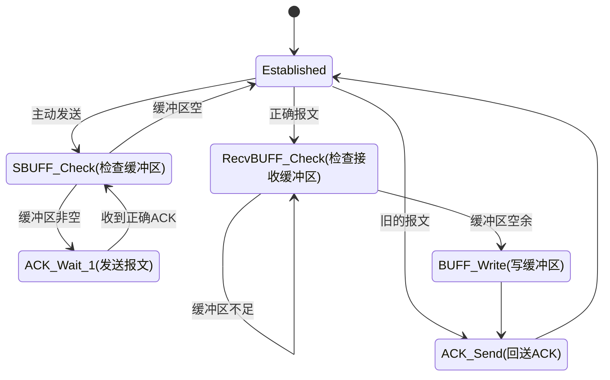

<p>
	<center><font size=8>UCONN</font></center><br>
	<center><font size=5 face="楷体">流量控制</font></center>
	<center><font face="楷体">Author：BobLi Swigger</font></center>
	<center><font face="楷体">日期：2020年12月11日</font></center>
</p>


<h1>目录</h1>

[TOC]

# 概述

流量控制有多种方式，本仓库实现：

- [ ] 停等机制
- [ ] GBN滑动窗口

# Uconn的流量控制

## 停等机制

停等机制是最简单、最基础的文件发送协议。发送端每次只发送一个报文，只要接收端收到了正确的报文，就会送ACK给发送端，然后发送端再次发送下一个报文。下面给出停等机制的有限状态机（FSM）。

停等机制的具体实现方式如下：

* 发送端每次发送一块缓冲区，发送成功返回发送缓冲区大小
* 接收端新建线程持续接收缓冲区，可以调用read函数读取缓冲区
* 任一端既是发送端，也是接收端

对于接收端，评价一个报文是否正确，可从以下几点判断：

* 数据报长度大于数据报头部最小长度

* 校验和正确（若协议不正确，则校验和几乎可以肯定是不正确的）
* 序列号与期待接收到的序列号一致



当抵达结束状态，可选择再次发送缓冲区，或者关闭连接。

可以认为，停等机制是实现可靠传输最基本、最简单的实现，甚至可以说它不能算作一种流量控制机制，而是为了实现可靠传输的最简单的方法。

停等机制还有一种实现方法：**将滑动窗口协议的窗口大小设置为1，即每次只发送一个报文**。本仓库的停等机制采用将滑动窗口的大小设置为1的方式实现。

## 滑动窗口

滑动窗口实现采用GBN方式，支持累积确认。

通俗来讲，发送端按照以下策略发送：

1. 当滑动窗口为空且文件读取结束时，发送完毕。
2. 否则持续发送滑动窗内仍未被确认的报文，每当收到窗口内的ACK时，将窗口的开始位置移动到最大ACK的确认序列号处。
3. 重复1、2步。

滑动窗口的伪代码如下：

```c++
将文件分为固定长度的块，每次读取一块;
while (文件仍未读取完毕 或 窗口非空0){
    if (文件没有读取完毕){
        if (窗口没有填满){
            填满窗口;
        }
        else{
            //窗口已经填满
            发送窗口内的所有报文;
            //窗口发送完毕，接收ACK
            等待网络延时;
            接收数据报，将窗口起始位置移动到最大ACK确认号处
        }
    else{
        //文件读取完毕（可能剩余最后一个数据块）
        if (如果文件剩余最后一块 并且 窗口仍有空余){
            将最后一块写入缓冲区
            continue;
        }
        else{
            //缓冲区已满或者最后一块数据已经读取完毕
            发送缓冲区;
            //接收ACK
            等待网络延时;
            接收数据报，将窗口起始位置移动到最大ACK确认号处;
            continue;
        }
    }
}
```

