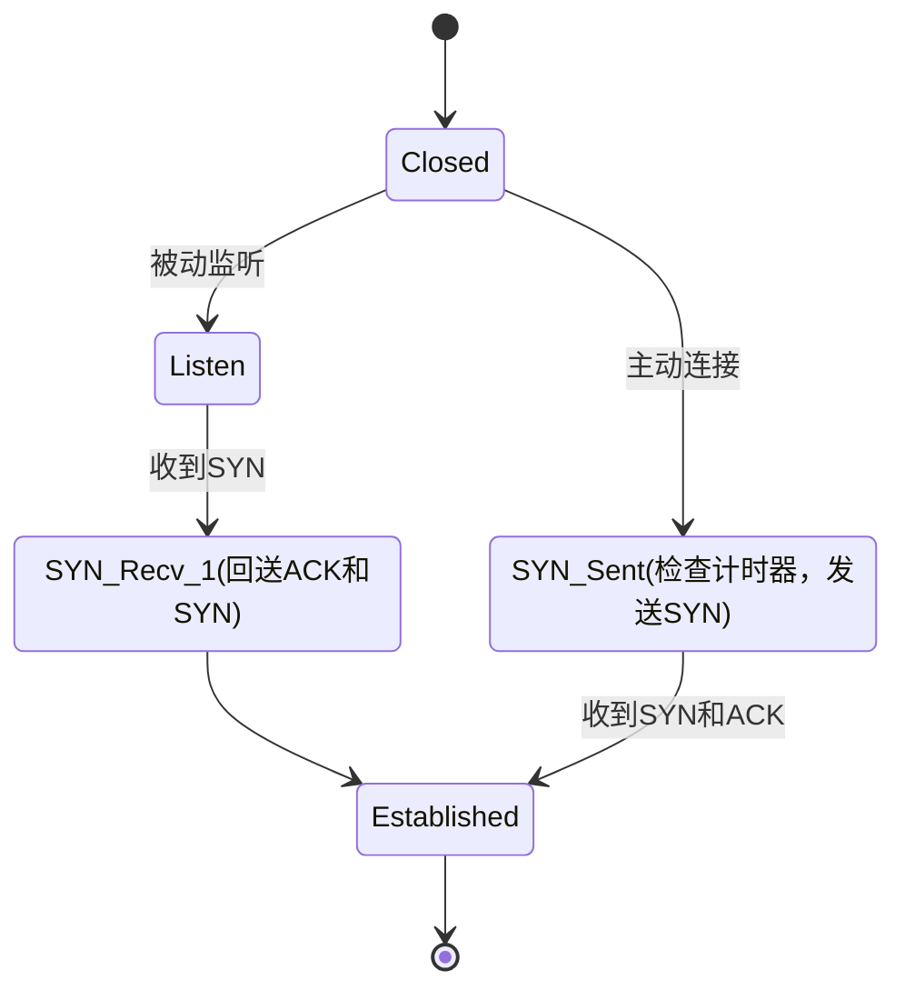
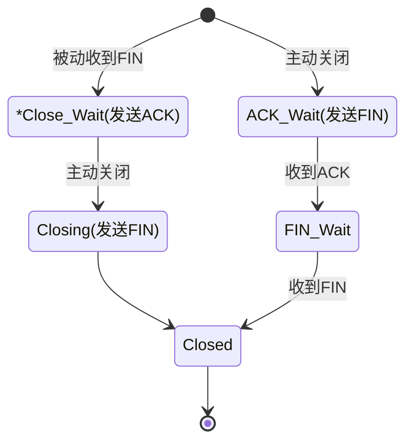

	
UCONN
 
	
连接建立和关闭

	
Author：BobLi Swigger

	
日期：2020年12月04日

<h1>目录</h1>

[TOC]

# 概述

本仓库要实现的目标是基于Socket套接字（UDP）编程实现的可靠传输协议。

最终要实现的效果是：提供一个编程接口，该接口提供缓冲区传输和文件传输功能，即将发送端的缓冲区无差错的复制到接收端的缓冲区上，或将文件无差错的复制到发送端。类似于用UDP实现一个TCP协议。

本仓库目前实现进度：

- [x] Uconn: 可靠传输
- [ ] 收发缓冲区接口
- [x] uSendFile收发文件接口

# 连接建立和关闭

## 建立连接

### 状态图

设置计数器，每次**状态**的转换都将计数器清零。每次转换到新的状态，都率先检查计时器，若超过最大尝试次数则关闭连接。

每个有条件的状态转换都是"阻塞"的。注意，这里的阻塞并不是说明其函数是阻塞的，而是仅当满足条件才进行状态转换。当某一状态阻塞时，每隔一段时间刷新该状态（重新执行动作），并将计数器+1。

注意，每隔一段时间刷新状态并将计数器+1导致的结果就是：一些特殊状态（比如监听），有可能在一定时间后返回连接失败，因此如果想持续监听，需要持续调度监听函数。这样做的好处就是：当没有连接发生时，不会一直阻塞在监听模式。

### 关于第二次和第三次握手

首先，作为服务端，只要收到了客户端的SYN请求，我们就回送ACK和SYN并认为已经建立连接，并忽略所有SYN请求。如果回送的报文丢失，客户端会不断发送SYN请求，而服务端也一直收不到正确的报文。这样，服务端和客户端都会因为超时而连接失败或断开。

仍然考虑上述情况，服务端回送的第二次握手丢失，虽然服务端认为连接已经建立，但是客户端仍然停留在发送SYN的状态，拒绝接受其他形式的报文。如果服务端想发送数据，会因为持续收不到回复而连接失败。

### 关于ACK

由于单独的一个ACK报文并不认为是数据，因此ACK不会占用序列号，因此第三次握手的ACK序列号。

### 接受状态

对于服务端，只要收到SYN，我们即可认为连接建立，因为对于服务端来说，客户端与服务器端的通信信道是正常的。虽然服务器端回送的SYN和ACK可能丢失，但是客户端只要设置超时，即可知道连接是否成功。如果回送的报文正常，则客户端也知道了通信信道是正常的。

如果一端想要发送数据，必然是一端主动发起连接（我们假设是客户端）。客户端若认为连接失败，则随机等待一段时间后重新建立连接即可。

## 关闭连接

关闭连接也同样是由双方协定好的，不存在一方想关闭连接时直接关闭连接的状况，必须经由双方同意才可关闭连接。

### 状态图

当然，本仓库实现方式为简化版，当任意一方想关闭连接，直接发送FIN并关闭即可。这样即使接收方没有收到FIN，只要等待超时，同样可以关闭连接，反而简化了设计。